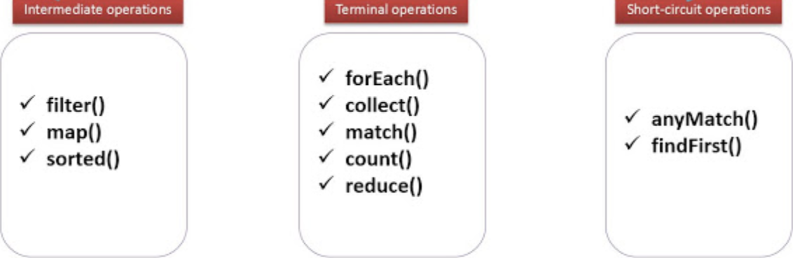

# Collections and Streams with Lambdas (You do - 20 min)

* Streams: A sequence of elements supporting sequential and parallel
aggregate operations.

* Collection: A list of elements \[ 1-\> 2-\> 3-\> 4-\> 5-\> 6\ ]

 

With streams we are able to apply different (multiple) operations on
collections at the same time. To be specific and make an example, image
our collection as a rolling belt used in industry, objects in the
rolling belt will pass through while different operators inspect and do
operations on the objects at the same time. This is what happens to
collections while using streams.

## Example: (You do)

```java
   public static void main(String[] args) {
      List<Person> people = Arrays.asList(
            new Person("Charles", "Dickens", 60),
            new Person("Lewis", "Carroll", 42),
            new Person("Thomas", "Carlyle", 51),
            new Person("Charlotte", "Bronte", 45),
            new Person("Matthew", "Arnold", 39)
            );


      //EXAMPLE 1:
      //printing out only the names of people who last name start with the letter C
      people.stream()
      .filter(p -> p.getLastName().startsWith("C"))
      .forEach(p -> System.out.println(p.getFirstName()));
      
      
      //EXAMPLE 2:
      //counting the number of people who last name start with the letter D
      long count = people.parallelStream()
      .filter(p -> p.getLastName().startsWith("D"))
      .count();
      
      System.out.println(count);

   }

}
```

* Example 1 explanation:

Starting with a collection (List) of elements Person named people, we
apply the method stream() using the dot notation, now the collection is
in a stream and multiple operations can be performed.

The first operation is filter(), this operator select only certain
elements of the list that pass a specific condition, the condition is
declared as Lambda expression. In our case, the lambda expression will
take each person from the list (input p) and select only the persons whose last
name start with the letter ‘C’ (body of the lambda expression).
Finally, only for the selected elements the operator forEach() will be
applied. It takes a new Lambda expression as input. In our case the
lambda method body will print out the first name of each person.

* Example 2 explanation:

Same as Example 1 but in this case the count() operator will be applied,
which does not take a lambda expression in input. It just counts the
elements that are in the filtered collection.


## Final considerationss (You do - 5 min)


Different operators that can be applied to the stream() method are the
following:


<span style="mso-no-proof:yes"></span>


These will allow a more performant execution of operations on
collections, thanks to Streams and Lambda Expression (Functional
Programming) in Java.
